# Entity Relationship Diagram (ERD)
## Database Portal Intranet Perpustakaan Nasional Republik Indonesia

Dokumen ini menyajikan rancangan **Entity Relationship Diagram (ERD)** dan **Kamus Data Relasional** yang mencerminkan struktur database MySQL sesuai seluruh sub menu pada Portal Intranet Perpusnas RI.

---

## 1. Diagram Konseptual & Relasi (Mermaid ERD)

```mermaid
erDiagram
    %% ====================================================
    %% MODUL AUTENTIKASI, PENGGUNA & HAK AKSES
    %% ====================================================
    peran ||--o{ pengguna : "dimiliki oleh"
    peran ||--|{ peran_izin : "memiliki"
    izin ||--|{ peran_izin : "ditetapkan ke"
    pengguna ||--|| profil_pegawai : "memiliki profil"
    pengguna ||--o{ log_aktivitas : "mencatat aktivitas"

    %% ====================================================
    %% MODUL KABAR KEDINASAN (SUB MENU DINAS)
    %% ====================================================
    pengguna ||--o{ berita : "menulis"
    pengguna ||--o{ pengumuman : "menerbitkan"
    pengguna ||--o{ agenda_kegiatan : "mengagendakan"
    pengguna ||--o{ laporan_perjalanan_dinas : "melaporkan"
    pengguna ||--o{ dokumen_intern : "mengunggah"

    %% ====================================================
    %% MODUL ANTAR PEGAWAI (SUB MENU KONTEN & INTERAKSI)
    %% ====================================================
    pengguna ||--o{ coretan_opini : "menulis opini"
    pengguna ||--o{ humor_pegawai : "membagikan humor"
    pengguna ||--o{ jelajah_bumi : "berbagi cerita travel"
    pengguna ||--o{ kabar_keluarga : "warta keluarga"
    pengguna ||--o{ kalimat_bijak : "kutipan inspirasi"
    pengguna ||--o{ karya_akademik : "riset & jurnal"
    pengguna ||--o{ tips_gaya_hidup : "tips & trik"
    pengguna ||--o{ olahraga : "jadwal & info olahraga"
    pengguna ||--o{ tahukah_anda : "trivia fakta"

    %% ====================================================
    %% MODUL KONSULTASI
    %% ====================================================
    pengguna ||--o{ topik_konsultasi : "membuat pertanyaan"
    topik_konsultasi ||--o{ balasan_konsultasi : "memiliki balasan"
    pengguna ||--o{ balasan_konsultasi : "memberi respon"

    %% ====================================================
    %% ENTITAS DAN ATRIBUT
    %% ====================================================
    peran {
        varchar id PK
        varchar nama UK
        text deskripsi
        datetime created_at
    }

    izin {
        varchar id PK
        varchar kode UK
        varchar modul
        text deskripsi
    }

    peran_izin {
        varchar id PK
        varchar peran_id FK
        varchar izin_id FK
    }

    pengguna {
        varchar id PK
        varchar nip UK
        varchar nama
        varchar email UK
        varchar password
        varchar peran_id FK
        varchar status
        datetime created_at
    }

    profil_pegawai {
        varchar id PK
        varchar user_id FK,UK
        varchar nip UK
        varchar nama_lengkap
        varchar jabatan
        varchar unit_kerja
        varchar gol_ruang
        varchar no_telepon
        text foto_profil
        text riwayat_pendidikan
        text riwayat_pekerjaan
        text prestasi
        text biografi
    }

    berita {
        varchar id PK
        varchar judul
        varchar slug UK
        text ringkasan
        longtext isi
        text gambar_sampul
        varchar penulis_id FK
        varchar status
        datetime tanggal_terbit
        int jumlah_baca
        boolean disematkan
    }

    pengumuman {
        varchar id PK
        varchar judul
        varchar slug UK
        text ringkasan
        longtext isi
        text file_lampiran
        varchar nama_lampiran
        varchar ukuran_file
        varchar penulis_id FK
        varchar status
        datetime tanggal_terbit
        boolean disematkan
    }

    agenda_kegiatan {
        varchar id PK
        varchar nama_kegiatan
        varchar slug UK
        longtext deskripsi
        datetime tanggal_mulai
        datetime tanggal_selesai
        varchar lokasi
        text gambar_sampul
        varchar penulis_id FK
        varchar status
        datetime tanggal_terbit
    }

    laporan_perjalanan_dinas {
        varchar id PK
        varchar judul_laporan
        varchar slug UK
        varchar kota_tujuan
        text ringkasan
        longtext laporan_lengkap
        text file_laporan
        varchar nama_file
        varchar penulis_id FK
        varchar status
        datetime tanggal_terbit
    }

    dokumen_intern {
        varchar id PK
        varchar nama_dokumen
        varchar slug UK
        text deskripsi
        varchar kategori_dokumen
        text file_url
        varchar nama_file
        varchar ukuran_file
        varchar penulis_id FK
        varchar status
        datetime tanggal_terbit
    }

    coretan_opini {
        varchar id PK
        varchar judul
        varchar slug UK
        longtext isi
        text gambar_sampul
        varchar penulis_id FK
        varchar status
        int jumlah_suka
        int jumlah_baca
    }

    humor_pegawai {
        varchar id PK
        varchar judul
        varchar slug UK
        longtext isi
        text gambar_sampul
        varchar penulis_id FK
        varchar status
        int jumlah_suka
        int jumlah_baca
    }

    jelajah_bumi {
        varchar id PK
        varchar judul
        varchar slug UK
        longtext isi
        text gambar_sampul
        varchar penulis_id FK
        varchar status
        int jumlah_suka
        int jumlah_baca
    }

    kabar_keluarga {
        varchar id PK
        varchar judul
        varchar slug UK
        longtext isi
        text gambar_sampul
        varchar penulis_id FK
        varchar status
        int jumlah_suka
        int jumlah_baca
    }

    kalimat_bijak {
        varchar id PK
        varchar judul
        varchar slug UK
        longtext isi
        text gambar_sampul
        varchar penulis_id FK
        varchar status
        int jumlah_suka
        int jumlah_baca
    }

    karya_akademik {
        varchar id PK
        varchar judul
        varchar slug UK
        longtext isi
        text gambar_sampul
        varchar penulis_id FK
        varchar status
        int jumlah_suka
        int jumlah_baca
    }

    tips_gaya_hidup {
        varchar id PK
        varchar judul
        varchar slug UK
        longtext isi
        text gambar_sampul
        varchar penulis_id FK
        varchar status
        int jumlah_suka
        int jumlah_baca
    }

    olahraga {
        varchar id PK
        varchar judul
        varchar slug UK
        longtext isi
        text gambar_sampul
        varchar penulis_id FK
        varchar status
        int jumlah_suka
        int jumlah_baca
    }

    tahukah_anda {
        varchar id PK
        varchar judul
        varchar slug UK
        longtext isi
        text gambar_sampul
        varchar penulis_id FK
        varchar status
        int jumlah_suka
        int jumlah_baca
    }

    topik_konsultasi {
        varchar id PK
        varchar judul
        varchar kategori
        text pertanyaan
        varchar penulis_id FK
        varchar status
        boolean is_private
        datetime created_at
    }

    balasan_konsultasi {
        varchar id PK
        varchar topik_id FK
        varchar penulis_id FK
        text isi_balasan
        boolean is_admin_reply
        datetime created_at
    }

    kupas_sosok {
        varchar id PK
        varchar nama_tokoh
        varchar slug UK
        varchar jabatan
        varchar unit_kerja
        text kutipan_inspiratif
        longtext cerita_lengkap
        text foto_url
        text prestasi
        text riwayat_karier
        boolean is_spotlight
    }

    pengaturan_beranda {
        varchar id PK
        varchar hero_title
        varchar hero_subtitle
        varchar hero_badge
        text hero_banner_url
        varchar quote_text
        varchar quote_author
        varchar quote_author_role
        varchar announcement_ticker
        datetime updated_at
    }

    log_aktivitas {
        varchar id PK
        varchar user_id FK
        varchar aksi
        varchar modul
        varchar target_id
        text deskripsi
        varchar ip_address
        datetime created_at
    }
```

---

## 2. Struktur Pengelompokan & Relasi Antar Tabel

### A. Pengguna & Keamanan (Core System)
1. **`pengguna`** *(User Accounts)*
   - Relasi: Banyak pengguna berelasi ke satu `peran` ($N:1$).
   - Relasi: Satu pengguna memiliki satu `profil_pegawai` ($1:1$).
   - Relasi: Satu pengguna dapat menulis banyak konten di seluruh sub menu ($1:N$).
2. **`peran` & `izin`** *(Role-Based Access Control / RBAC)*
   - Relasi Banyak-ke-Banyak ($M:N$) dijembatani tabel asosiasi **`peran_izin`**.
3. **`log_aktivitas`** *(Audit Trail)*
   - Relasi: Setiap aksi administratif dicatat dan terhubung ke `pengguna.id` ($N:1$, `ON DELETE SET NULL`).

---

### B. Sub Menu Kabar Kedinasan
Seluruh tabel dinas berelasi langsung ke `pengguna` (`penulis_id`):
- **`berita`**: Berita dan rilis pers kegiatan perpustakaan.
- **`pengumuman`**: Surat edaran, keputusan kedinasan, dan file lampiran.
- **`agenda_kegiatan`**: Kalender acara dinas, rapat koordinasi, diklat, dan lokasi.
- **`laporan_perjalanan_dinas`**: Catatan perjalanan dinas pegawai ke wilayah/daerah beserta dokumen bukti tugas.
- **`dokumen_intern`**: Repositori SOP, formulir kerja, dan pedoman birokrasi internal.

---

### C. Sub Menu Antar Pegawai (Rubrik Sosial & Komunitas)
Setiap rubrik interaksi internal pegawai memiliki tabel independen yang terhubung ke `pengguna`:
- **`coretan_opini`**: Opini dan gagasan pegawai.
- **`humor_pegawai`**: Pojok hiburan dan cerita santai.
- **`jelajah_bumi`**: Dokumentasi perjalanan wisata, budaya, dan kunjungan nusantara.
- **`kabar_keluarga`**: Berita suka dan duka keluarga besar pegawai.
- **`kalimat_bijak`**: Kutipan kata mutiara dan inspirasi.
- **`karya_akademik`**: Jurnal kepustakawanan, riset, dan artikel ilmiah ASN.
- **`tips_gaya_hidup`**: Tips kesehatan kerja, ergonomis, dan finansial.
- **`olahraga`**: Jadwal latihan bersama dan komunitas olahraga Perpusnas.
- **`tahukah_anda`**: Trivia perpustakaan dan fakta unik peradaban literasi.
- **`topik_konsultasi` & `balasan_konsultasi`**: Modul Q&A internal kepegawaian, IT, dan kesehatan.

---

### D. Sub Menu Kupas Sosok & Pengaturan Beranda
- **`kupas_sosok`**: Menampilkan tokoh inspiratif, pustakawan teladan, dan pejabat purnatugas.
- **`pengaturan_beranda`**: Tabel konfigurasi dinamis untuk tata letak banner, kutipan pimpinan, dan pengumuman ticker di homepage.

---

## 3. Kamus Data Utama (Data Dictionary)

| Nama Tabel | Primary Key | Foreign Keys | Deskripsi Sub Menu |
| :--- | :--- | :--- | :--- |
| `pengguna` | `id` | `peran_id` $\rightarrow$ `peran.id` | Akun pengguna intranet |
| `profil_pegawai` | `id` | `user_id` $\rightarrow$ `pengguna.id` | Data biografi, NIP, unit kerja, pendidikan |
| `berita` | `id` | `penulis_id` $\rightarrow$ `pengguna.id` | Menu Kabar Kedinasan $\rightarrow$ Berita |
| `pengumuman` | `id` | `penulis_id` $\rightarrow$ `pengguna.id` | Menu Kabar Kedinasan $\rightarrow$ Pengumuman |
| `agenda_kegiatan` | `id` | `penulis_id` $\rightarrow$ `pengguna.id` | Menu Kabar Kedinasan $\rightarrow$ Agenda |
| `laporan_perjalanan_dinas` | `id` | `penulis_id` $\rightarrow$ `pengguna.id` | Menu Kabar Kedinasan $\rightarrow$ Laporan Perjalanan |
| `dokumen_intern` | `id` | `penulis_id` $\rightarrow$ `pengguna.id` | Menu Kabar Kedinasan $\rightarrow$ Dokumen Intern |
| `coretan_opini` | `id` | `penulis_id` $\rightarrow$ `pengguna.id` | Menu Antar Pegawai $\rightarrow$ Coretan Opini |
| `humor_pegawai` | `id` | `penulis_id` $\rightarrow$ `pengguna.id` | Menu Antar Pegawai $\rightarrow$ Humor Pegawai |
| `jelajah_bumi` | `id` | `penulis_id` $\rightarrow$ `pengguna.id` | Menu Antar Pegawai $\rightarrow$ Jelajah Bumi |
| `kabar_keluarga` | `id` | `penulis_id` $\rightarrow$ `pengguna.id` | Menu Antar Pegawai $\rightarrow$ Kabar Keluarga |
| `kalimat_bijak` | `id` | `penulis_id` $\rightarrow$ `pengguna.id` | Menu Antar Pegawai $\rightarrow$ Kalimat Bijak |
| `karya_akademik` | `id` | `penulis_id` $\rightarrow$ `pengguna.id` | Menu Antar Pegawai $\rightarrow$ Karya Akademik |
| `tips_gaya_hidup` | `id` | `penulis_id` $\rightarrow$ `pengguna.id` | Menu Antar Pegawai $\rightarrow$ Tips & Gaya Hidup |
| `olahraga` | `id` | `penulis_id` $\rightarrow$ `pengguna.id` | Menu Antar Pegawai $\rightarrow$ Olahraga |
| `tahukah_anda` | `id` | `penulis_id` $\rightarrow$ `pengguna.id` | Menu Antar Pegawai $\rightarrow$ Tahukah Anda |
| `topik_konsultasi` | `id` | `penulis_id` $\rightarrow$ `pengguna.id` | Menu Antar Pegawai $\rightarrow$ Konsultasi |
| `balasan_konsultasi` | `id` | `topik_id` $\rightarrow$ `topik_konsultasi.id`, `penulis_id` $\rightarrow$ `pengguna.id` | Balasan konsultasi kepegawaian/IT/kesehatan |
| `kupas_sosok` | `id` | - | Menu Kupas Sosok (Tokoh Inspiratif) |
| `pengaturan_beranda` | `id` | - | Menu Admin $\rightarrow$ Kelola Halaman Utama |
| `log_aktivitas` | `id` | `user_id` $\rightarrow$ `pengguna.id` | Menu Admin $\rightarrow$ Log Aktivitas |
